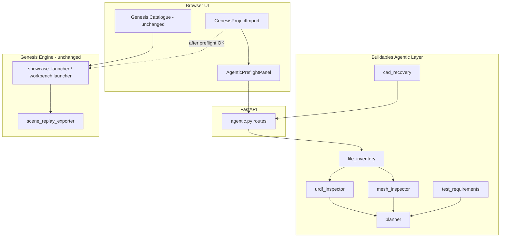

# Agentic Simulation Architecture

## Principle: Genesis is the engine, not the intelligence layer

Genesis provides physics simulation, rendering, and sensor capture. The **Buildables Agentic Simulation Layer** owns:

- File inspection and inventory
- Test requirement evaluation
- Deterministic preflight planning
- (Future) code generation, execution orchestration, engineering reporting

Catalogue demos and the showcase launcher remain unchanged. Custom project launches should pass through preflight before Genesis runs.

## Architecture diagram

## Pipeline stages

| Stage | Module | Part 1 status |
|-------|--------|---------------|
| 1. Critic / Planner | `planner.py`, `test_requirements.py` | Deterministic (no LLM) |
| 2. Code-Gen | `codegen.py` | Stub |
| 3. Execution | `executor.py` | Stub (local worker planned) |
| 4. Reporter | `reporter.py` | Stub |

## Schemas (`apps/api/app/services/agentic/schemas.py`)

| Model | Purpose |
|-------|---------|
| `UploadedAsset` | Inventoried file with role, hash, path |
| `RobotDescriptionInspection` | URDF/MJCF parse + mesh refs |
| `MeshReference` | Single URDF mesh path resolution |
| `MeshInspection` | trimesh validation result |
| `SimulationTestSpec` | Data-driven test definition |
| `TestReadinessResult` | Per-test can_run / blockers |
| `SimulationPlan` | Full preflight plan |
| `GeneratedSimulationScript` | Future codegen output |
| `ExecutionResult` | Future run artifacts |
| `EngineeringReport` | Future telemetry explanation |

## Test matrix (MVP)

| test_id | Category | Runnable in Genesis MVP? |
|---------|----------|--------------------------|
| gravity_stability | rigid | Yes |
| joint_sweep | robot_motion | Yes |
| imu_sensor | sensor | Yes (defaults) |
| contact_force | sensor | Yes |
| depth_camera | sensor | Yes |
| thermal_grid_readiness | thermal | Partial / readiness |
| fea_readiness | fea_readiness | Readiness only |
| cfd_readiness | cfd_readiness | Readiness only |

FEA/CFD tests never claim full solver execution — only readiness checks.

## Dependency strategy

- **Required:** pydantic-ai, urdfpy, trimesh, lxml, numpy, fastapi
- **Optional:** cadquery (STEP via CadQuery), e2b (remote sandbox), crewai (multi-agent)
- **Existing:** FreeCAD CLI for STEP mesh export (`step_mesh_converter.py`)

Feature flags: `CADQUERY_AVAILABLE`, `E2B_AVAILABLE`, `CREWAI_AVAILABLE` in `dependencies.py`.

## Execution plan: local vs E2B

| Phase | Execution |
|-------|-----------|
| Part 1 | Preflight only — no Genesis from agentic routes |
| Part 2 | Local subprocess via `executor.py` wrapping `showcase_launcher.py` |
| Later | Optional E2B sandbox for untrusted/generated scripts |

## Data files

| File | Location |
|------|----------|
| `asset_inventory.json` | `sim-data/projects/{id}/` |
| `import_validation.json` | Existing — kept for compat |
| Replay | `runs/showcase-{id}/state_timeseries.json` |
| Telemetry | Replay bundle or `telemetry_timeseries.json` |

## API endpoints (preflight only)

- `GET /agentic/dependencies`
- `POST /projects/{id}/scan`
- `POST /projects/{id}/inspect`
- `POST /projects/{id}/plan`
- `GET /projects/{id}/test-requirements`
- `POST /projects/{id}/recover/step-preview`
- `POST /projects/{id}/recover/missing-meshes`

## MVP vs later

**MVP (Part 1):** Inventory, inspection, test matrix, planner, API, preflight UI panel.

**Later:** CopilotKit chat UI, pydantic-ai LLM explanations, Genesis template codegen, local execution validation, engineering reporter, E2B sandbox, CrewAI multi-agent, FEA/CFD expansion.
